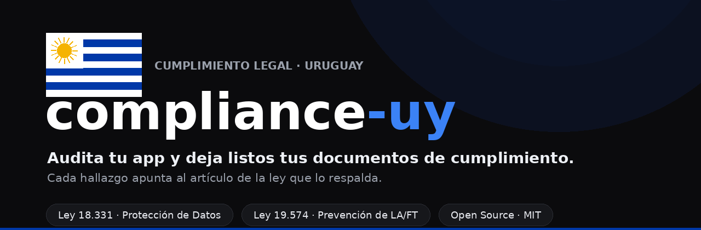

<div align="center">



# compliance-uy

### Cumplimiento de datos para tu SaaS uruguayo, desde la terminal

Una skill de [Claude Code](https://claude.ai/code) que lee tu código, arma los documentos de
cumplimiento y te deja listo para cumplir **sin abogado**. Cada conclusión apunta al artículo de la ley
que la respalda; el abogado queda como un plus opcional, no como requisito para partir.

[](LICENSE)


</div>

---

## Por qué

La Ley 18.331 de protección de datos **rige desde 2008** y casi nadie la cumple del todo: la
**inscripción de las bases en la URCDP** (Art. 29) se ignora seguido, el reglamento moderno (Decreto
64/020) agregó **brechas en 72 horas**, **DPO**, **evaluación de impacto** y **responsabilidad proactiva**,
y la URCDP puede aplicar **multas de hasta 500.000 UI** más suspensión o clausura de la base. Para los
**sujetos obligados**, la Ley 19.574 de prevención de lavado suma otro frente.

compliance-uy hace el trabajo completo en una corrida: el inventario, los documentos y el diagnóstico
técnico. La idea es que un founder arme su cumplimiento solo, sin equipo legal ni un estudio cobrándole
por el trabajo mecánico.

## Qué hace

Corrés `/compliance-uy` sobre tu repo y:

1. Te pregunta lo básico: empresa, si sos responsable o encargado de los datos, y qué marcos auditar.
2. Lee el código y mapea qué datos personales guardás y a qué proveedores se van (las transferencias
   fuera de Uruguay).
3. Evalúa los controles con un catálogo que puntúa varias leyes a la vez.
4. Arma los documentos: RAT, política de privacidad, DPA, plan de brechas, inscripción de bases en la
   URCDP, evaluación de impacto y —si sos sujeto obligado— el programa de prevención de LA/FT.
5. Guarda el estado en `.compliance/` y lo versiona, así ves qué mejora o qué se rompe entre corridas.
6. Te explica cada decisión con su artículo y trae guías para cuando pase algo: un derecho de acceso, una
   brecha, una inspección.
7. **Construye las remediaciones**: como corre en Claude Code, puede implementar los arreglos (MFA,
   cifrado en reposo, audit log, endpoints de acceso/supresión, retención) y **montar el monitoreo**
   (secret scanning, HIBP, alertas), siguiendo recetas con librerías verificadas. Ver `references/build/`.

## Marcos cubiertos

| Pack | Ley | Estado | Cubre |
|------|-----|--------|-------|
| `ley-18331` | Protección de Datos Personales (+ Ley 19.670 / Decreto 64/020) | **ya vigente** | consentimiento, derechos de acceso/rectificación/supresión, RAT, DPA, seguridad, brechas (72h), DPO, DPIA, inscripción URCDP, transferencias |
| `ley-19574` | Prevención de LA/FT (sujetos obligados) | **ya vigente** | debida diligencia, beneficiario final, PEP, ROS, oficial de cumplimiento, matriz de riesgos |
| _próximos_ | RGPD · ISO 27001 · SOC 2 | extensible | agregar un marco es agregar un `pack` |

## Quickstart

```bash
# 1. Instalar (la skill es este repo)
git clone https://github.com/compliance-uy/compliance-uy ~/.claude/skills/compliance-uy

# 2. En Claude Code, dentro del repo a auditar:
/compliance-uy
```

## Ejemplo de output

La skill escribe en el repo auditado un estado vivo y versionable:

```text
.compliance/
├── state.json        # postura por marco + estado de cada control (con evidencia archivo:línea)
├── RESUMEN.md        # brechas priorizadas + qué resolviste + diff vs la corrida anterior
├── INSTRUCTIVO.md    # guías: habeas data · brecha 72h · inspección URCDP · ROS · calendario
└── docs/
    ├── 18331-rat.md  18331-politica-privacidad.md  18331-dpa.md  18331-plan-respuesta-brechas.md
    │   18331-inscripcion-bases-urcdp.md  18331-dpia.md
    └── 19574-programa-prevencion-laft.md  19574-procedimiento-debida-diligencia.md  19574-matriz-riesgos.md
```

Cada corrida es un commit, así que git te queda como historial: ves cuándo subió o bajó tu postura y
quién cambió qué.

## Respaldado en la ley

El contenido legal se contrasta contra el texto oficial que viene en [`sources/`](sources/): el texto
consolidado de **IMPO** (Ley 18.331, Decretos 414/009 y 64/020, Ley 19.670, Ley 19.574, Decreto 379/018),
con [`FUENTES.md`](sources/FUENTES.md) (URL, SHA-256 y el comando para volver a bajarlos). En
[`mapa-articulos-18331.md`](references/mapa-articulos-18331.md) y
[`mapa-articulos-19574.md`](references/mapa-articulos-19574.md) cada artículo está chequeado contra el
texto, con la línea donde aparece. Lo que no se puede confirmar ahí queda marcado como
`[verificar contra fuente oficial]`.

> Uruguay tiene **adecuación de la UE** (Decisión 2012/484/UE) y ratificó el **Convenio 108+** del Consejo
> de Europa: su régimen de datos es de los más sólidos de la región.

## Estructura

```text
SKILL.md                          # el motor (multi-pack, se apoya en sources/)
SECURITY.md                       # cómo maneja tus datos/secretos + reporte de vulnerabilidades + alcance
references/
  controls.md                     # catálogo de controles + crosswalk (un control cubre varias leyes)
  output-model.md                 # formato del estado .compliance/
  cuando-acudir-a-abogado.md      # por qué el abogado es opcional (lo armas vos)
  instructivo-situaciones.md      # guías operativas
  mapa-articulos-18331.md         # artículos de datos chequeados contra el texto oficial
  mapa-articulos-19574.md         # artículos de LA/FT chequeados contra el texto oficial
  build/                          # recetas de implementación (MFA, cifrado, audit log, derechos, monitoreo)
packs/
  ley-18331/  ley-19574/          # obligaciones + plantillas por marco
sources/                          # textos legales oficiales (IMPO) + FUENTES.md (reproducible)
```

## Roadmap

- [ ] Completar el mapa de artículos (habeas data, transferencias, reformas recientes de la 19.574).
- [ ] Packs nuevos: RGPD, ISO 27001, SOC 2.
- [ ] Mejor detección de cambios entre corridas.
- [ ] Revisión legal opcional de las plantillas (un plus, no un requisito).

## Contribuir

Se agradecen issues y PRs, sobre todo packs nuevos, correcciones de artículos chequeadas contra el
texto oficial, y mejoras a las guías. Leé [`CONTRIBUTING.md`](CONTRIBUTING.md).

## Qué no hace

- **Auditar lo que no está en el código.** La privacidad **no vive solo en el repo**: también fluye por
  correo, WhatsApp, CRM, planillas, herramientas SaaS, formularios en papel y procesos manuales. La skill
  escanea el código y te lo recuerda, pero esos canales quedan a cargo del responsable (ver [`SECURITY.md`](SECURITY.md)).
- **Monitoreo / detección de filtraciones en tiempo real** (DLP, alertas 24/7): es un servicio corriendo
  siempre, no una skill on-demand. La skill prepara el plan de respuesta y puede configurar alertas sobre
  el audit log, pero la vigilancia en vivo es otra categoría.
- **Ser el DPO ni generar cultura interna.** El delegado de protección de datos (cuando es obligatorio) es
  **una persona**, no la skill: ayudamos a designarlo y documentarlo, pero el rol lo sostiene un humano.
- **Representarte** ante la URCDP, SENACLAFT o tribunales (eso es de un abogado) ni reemplazar la auditoría
  independiente del programa de LA/FT donde se exija (la hace un tercero).

No reemplaza a un abogado ni **garantiza** cumplimiento: te deja **borradores y un diagnóstico** que te
acercan, te dicen qué falta, y la decisión final (con revisión humana) es tuya.

## Agradecimientos

`compliance-uy` es una adaptación al marco legal uruguayo de
**[compliance-cl](https://github.com/Lelemon-studio/compliance-cl)**, creado por
**[Lelemon Studio](https://github.com/Lelemon-studio)** 🇨🇱. Gracias por abrir el camino, publicarlo open
source bajo MIT y por la discusión que generó en la comunidad —de la que salieron varias de las mejoras de
este repo (manejo de secretos, límites de alcance, claridad sobre el rol del DPO). 🙏

La arquitectura del motor (packs, controles + crosswalk, estado versionado en `.compliance/`, fuentes
oficiales como verdad) es suya; acá se reescribió el contenido legal para Uruguay (Ley 18.331 + Ley 19.574)
contrastándolo contra el texto oficial de IMPO.

## Aviso

Esto no es asesoría legal: un software no asume tu responsabilidad legal, la decisión final es tuya. Te
deja listo para cumplir solo. Un abogado es un plus opcional si querés una revisión, y solo es
imprescindible si te inspeccionan y escala a una disputa (la representación, por ley, la hace un abogado).
Ver [`NOTICE.md`](NOTICE.md).

## Licencia

[MIT](LICENSE) © 2026 compliance-uy contributors
